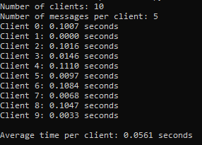
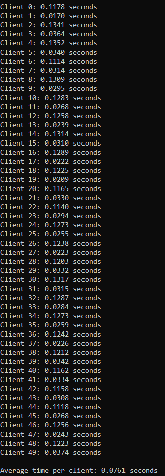
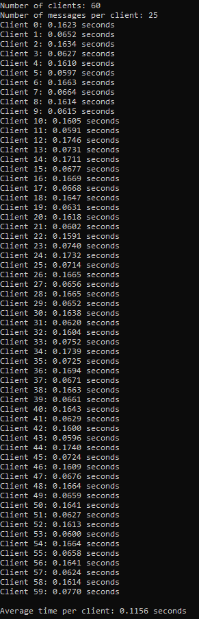

# Chatroom Application - Network Programming Project @ FMI 2024

## Table of Contents

1. [Introduction](#introduction)
2. [How to Run the Application](#how-to-run-the-application)
3. [Architecture](#architecture)

## Introduction
This is a console chatroom application consisting of a server and client written in Python. Key features:
- Broadcast messages
- Features like private messaging and listing of active users
- User login and logout

## How to Run the Application

### Prerequisites
Ensure Python 3.x is installed on your system. 

### Installation
1. Clone/Download this Repoditory
`git clone <repository_url>`
`cd <project_directory>`
2. Create and Activate a Virtual Environment 
- on Windows 
`python -m venv venv`
`venv\Scripts\avtivate`
- on Linux/Mac 
`python3 -m venv venv`
`source venv/bin/activate`
3. Run the Server 
 Open a terminal, navigate to the project directory and start the server
 `python server.py`
4. Run the Client 
 Open a separate terminal (or multiple terminals to simulate multiple users), navigate to the project directory and start the client
`python client.py` 
5. Join the Chatroom
 Enter a username when prompted in the client and start sending messages
6. Run the benchmark
 Open a terminal, navigate to the project directory and start the benchmark
`python benchmark.py`
7. Exit the Virtual Emvironment

## Architecture

### Server (server.py)
The server is responsible for:
- Accepting and managing client connections.
- Broadcasting messages to all users.
- Supporting commands like:
    - `!who` - list active users;
    - `!msg <user> <message>` - enables private messaging;
    - `!logout` - handles user disconnections.

Design Choice:
 The server listens on a specified IP and port. It accepts new connections and mainains a list of active sockets and associated client data. It handles new connections by registering the client and notifying other of their arrival. The disconnections are handles by removing the user from the active list and notifying the remaining clients. Iuses the select module to handle multiple client sockets simultaneously, allowing for more efficient management of multiple connections.

Tools used:
- The socket and select libraries.

### Client (client.py)
The client enables users to:
- Send and receive messages in real-time.
- Log out cleanly.

Design Choice:
 The client connects to the server using a socket with a specified IP address and port. When a connection has been established it prompts the user to enter a username. It uses multithreading to handle sending and receiving messages concurrently, ensuring real-time communication without blocking the user interface.

Tools used:
- The socket, threading, and errno libraries.

### Benchmarking the time for multiple clients interacting with the server (benchmark.py)

The script:
- Runs multiple threads, where each thread is a client that connects to the server, sends a series of messages and waits for responses.
- Records the time before sending and after receiving messages and calculates how long it took for a client to interact with the server. These metrics are stored in a dictionary (results), with each client's time or error message logged. - Calculates the average response time accross all successful clients.   

Examples:
Benchmark for 10 users and 5 messages per user:
 

Benchmark for 50 users and 10 messages per user:
 

Benchmark for 60 users and 25 messages per user:
 

Tools used:
The socket, threading and time libraries.